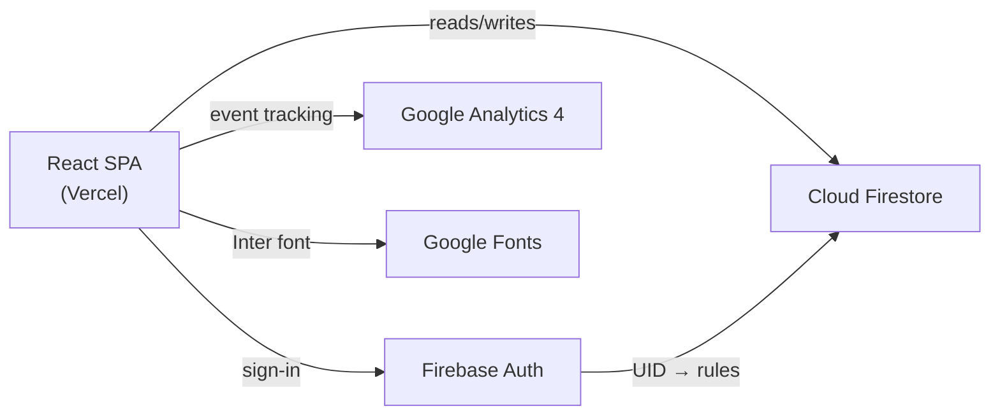

# Architecture — __APP_NAME__

> PromptWars Challenge [N] | __DATE__

---

## System Overview

<!-- Extend diagram with Gemini/Maps/Storage if used this challenge -->

---

## Technology Decisions

| Layer | Choice | Rationale |
|-------|--------|-----------|
| Language | TypeScript strict | Compile-time safety, no runtime type errors |
| Frontend | React 18 + Vite | Fast HMR, modern JSX transform, tree-shaking |
| Styling | Tailwind CSS | Utility-first, no unused CSS in build |
| Auth | Firebase Auth | Session management, integrates with Firestore rules |
| Database | Cloud Firestore | Real-time subscriptions, offline persistence |
| Analytics | Google Analytics 4 | User tracking, custom events, production monitoring |
| Frontend Hosting | Vercel | CDN-delivered, security headers via vercel.json |
| Backend Hosting | Firebase Hosting | Backend/API, security headers via firebase.json |
| Testing | Vitest + RTL + Playwright | Fast, 70% coverage gate, E2E smoke |
| CI | GitHub Actions | Lint → typecheck → test → coverage → E2E |

---

## Component Inventory

| Component | Location | Responsibility |
|-----------|----------|---------------|
| `ErrorBoundary` | `components/ui/` | Catches render errors, logs to GA4, shows fallback |
| `Button` | `components/ui/` | Accessible button with loading + disabled states |
| `Input` | `components/ui/` | Accessible input with label + error ARIA |
| `FormField` | `components/ui/` | Label + input + error as one accessible unit |
| `Modal` | `components/ui/` | Focus-trapped dialog, Escape to close |
| `LoadingSpinner` | `components/ui/` | aria-live loading indicator |
| _Add features below_ | `components/features/` | |

---

## Service Layer

| Service | File | Responsibility |
|---------|------|---------------|
| `analyticsService` | `services/analyticsService.ts` | All GA4 event logging |
| `authService` | `services/authService.ts` | Firebase Auth sign-in/out |
| _Add per challenge_ | `services/[name]Service.ts` | |

---

## Data Flow

1. `env.ts` validates all env vars at startup → fail-fast if misconfigured
2. Firebase Auth checks session on load → sets user context
3. Authenticated → Firestore real-time subscription starts
4. User action → service function → `ApiResponse<T>` returned (never throws)
5. Error → caught in hook → `analyticsService.trackError()` → user sees error state
6. Route change → `analyticsService.trackPageView()` fires

---

## Security Model

| Concern | Mitigation |
|---------|-----------|
| API key exposure | `.env.local` only; `ENV` object validates at startup |
| Firestore access | Deny-all default; per-collection rules require auth + field validation |
| Clickjacking | `X-Frame-Options: DENY` in both `vercel.json` + `firebase.json` |
| Content injection | CSP header in both deployment configs |
| Transport | HSTS with preload in both deployment configs |

---

## Known Trade-offs

| Decision | Trade-off |
|----------|----------|
| Client-side only | No SSR; initial paint slightly slower on cold cache |
| Firestore direct | No API layer; Firestore rules must be correct |
| In-memory state | Refresh loses unsaved state; acceptable for challenge scope |
