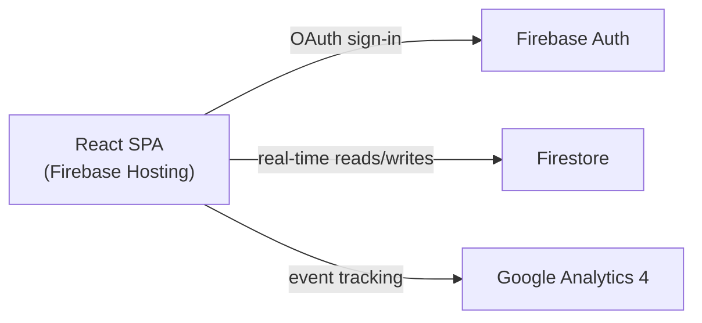

# PROMPTWARS — SKILL 2: FILE TEMPLATES
### Send as: Message 1 at Phase 1 ONLY (not every session — too long)
### Contains: firebase.json, vercel.json, CI yml, test suites, sw.js, services, GOOGLE_SERVICES.md, README, ARCHITECTURE templates
### Version: 5.0 | 619 lines

---

## GITHUB INFRASTRUCTURE (REQUIRED — HIGH CODE QUALITY SIGNAL)

The AI evaluator reads ALL files in the repo. Infrastructure files around the code score just as much as the code itself.

### `.github/workflows/ci.yml`

```yaml
name: CI

on:
  push:
    branches: [main]
  pull_request:
    branches: [main]

concurrency:
  group: ${{ github.workflow }}-${{ github.ref }}
  cancel-in-progress: true

jobs:
  frontend:
    name: Frontend
    runs-on: ubuntu-latest
    defaults:
      run:
        working-directory: .

    steps:
      - uses: actions/checkout@v4

      - name: Set up Node
        uses: actions/setup-node@v4
        with:
          node-version: '20'
          cache: npm

      - name: Install dependencies
        run: npm ci

      - name: Lint (ESLint + jsx-a11y)
        run: npm run lint

      - name: Type-check
        run: npx tsc -b --noEmit

      - name: Run tests with coverage
        run: npm test -- --coverage --reporter=default --reporter=junit --outputFile=junit.xml

      - name: Coverage threshold (hard 70%)
        run: |
          node -e "
            const s = require('./coverage/coverage-summary.json').total;
            const pct = s.lines.pct;
            const target = 70;
            console.log('Coverage: ' + pct + '% (target: ' + target + '%)');
            if (pct < target) { console.error('Coverage below target'); process.exit(1); }
          "

      - name: Upload coverage
        if: always()
        uses: actions/upload-artifact@v4
        with:
          name: coverage-report
          path: coverage/

  firestore-rules:
    name: Firestore Rules
    runs-on: ubuntu-latest
    if: github.event_name == 'pull_request'
    steps:
      - uses: actions/checkout@v4
      - uses: actions/setup-node@v4
        with:
          node-version: '20'
      - uses: actions/setup-java@v4
        with:
          distribution: temurin
          java-version: '17'
      - name: Install Firebase CLI
        run: npm install -g firebase-tools
      - name: Run rules tests
        run: firebase emulators:exec --only firestore --project test-project "npm run test:rules"
```

### `CONTRIBUTING.md` Template

```markdown
# Contributing to [App Name]

## Quick Start

1. Fork & clone
2. `git switch -c feat/your-feature`
3. Make changes, run tests locally
4. Open a PR against `main`

## Running Tests

```bash
npm test                    # Unit + component tests
npm run test:coverage       # With coverage report
npm run test:e2e            # Playwright smoke tests
npm run lint                # ESLint
npx tsc --noEmit            # Type check
```

## Branch Naming

- `feat/short-desc` — new feature
- `fix/short-desc` — bug fix
- `docs/short-desc` — documentation
- `chore/short-desc` — maintenance

## PR Checklist

- [ ] Tests pass locally (`npm test`)
- [ ] Types pass (`npx tsc --noEmit`)
- [ ] Lint passes (`npm run lint`)
- [ ] No secrets or `.env` files committed
- [ ] Accessibility: keyboard nav tested
- [ ] `README.md` updated if needed
```

### `.github/pull_request_template.md`

```markdown
## Summary
<!-- What this changes and why — 2-3 sentences -->

## Type of change
- [ ] Feature
- [ ] Bug fix
- [ ] Refactor
- [ ] Docs
- [ ] Tests

## Checklist
- [ ] `npm test` passes
- [ ] `npx tsc --noEmit` passes
- [ ] `npm run lint` passes
- [ ] No secrets committed
- [ ] Accessibility tested with keyboard navigation
- [ ] README updated if needed
```

### `docs/ARCHITECTURE.md` Template

```markdown
# Architecture

## System Overview



## Component Inventory

| Module | Location | Responsibility |
|--------|----------|---------------|
| Auth | `src/services/authService.ts` | Firebase Auth sign-in/out |
| Analytics | `src/services/analyticsService.ts` | GA4 event tracking |
| [Feature] | `src/services/[name]Service.ts` | [what it does] |

## Data Flow

1. User opens app → Firebase Auth checks session
2. Authenticated user → Firestore real-time subscription starts
3. User actions → GA4 events logged via `analyticsService`
4. Writes → Firestore rules enforce auth + field validation

## Key Design Decisions

| Decision | Rationale |
|----------|-----------|
| React + Vite | Fast builds, HMR, modern tooling |
| Firestore | Real-time updates without polling |
| TypeScript strict | Catches bugs at compile time, not runtime |
| Firebase Hosting | CDN-delivered, integrates with Auth/Firestore |
```

### `LICENSE` (MIT — 30 seconds, always include)

```
MIT License

Copyright (c) 2026 [Your Name]

Permission is hereby granted, free of charge, to any person obtaining a copy
of this software and associated documentation files (the "Software"), to deal
in the Software without restriction...
```

### `vitest.config.ts` — Coverage Threshold

```typescript
import { defineConfig } from 'vitest/config';
import react from '@vitejs/plugin-react';

export default defineConfig({
  plugins: [react()],
  test: {
    environment: 'jsdom',
    setupFiles: ['./src/test/setup.ts'],
    coverage: {
      provider: 'v8',
      reporter: ['text', 'json', 'html', 'json-summary'],
      // Hard gate — tests fail below this threshold
      thresholds: {
        lines: 70,
        functions: 70,
        branches: 60,
        statements: 70,
      },
      exclude: [
        'src/test/**',
        'src/types/**',
        'src/vite-env.d.ts',
        '**/*.config.*',
      ],
    },
  },
});
```

### Playwright E2E Smoke Test

```typescript
// tests/e2e/smoke.spec.ts
import { test, expect } from '@playwright/test';

test('app loads and shows main navigation', async ({ page }) => {
  await page.goto('/');
  await expect(page).toHaveTitle(/[App Name]/i);
  await expect(page.getByRole('navigation')).toBeVisible();
  await expect(page.getByRole('main')).toBeVisible();
});

test('skip link exists and is keyboard accessible', async ({ page }) => {
  await page.goto('/');
  await page.keyboard.press('Tab');
  const skipLink = page.getByText('Skip to main content');
  await expect(skipLink).toBeFocused();
});

test('page has no obvious accessibility violations', async ({ page }) => {
  await page.goto('/');
  // Check all images have alt text
  const images = page.locator('img:not([alt])');
  await expect(images).toHaveCount(0);
});
```

### `eslint.config.js` — With `jsx-a11y` Plugin

```javascript
import js from '@eslint/js';
import tseslint from 'typescript-eslint';
import reactHooks from 'eslint-plugin-react-hooks';
import a11y from 'eslint-plugin-jsx-a11y'; // ← accessibility linting in CI

export default tseslint.config(
  js.configs.recommended,
  ...tseslint.configs.strictTypeChecked,
  {
    plugins: {
      'react-hooks': reactHooks,
      'jsx-a11y': a11y,
    },
    rules: {
      ...reactHooks.configs.recommended.rules,
      ...a11y.configs.recommended.rules, // ← catches missing aria-labels in CI
      '@typescript-eslint/no-explicit-any': 'error',
      '@typescript-eslint/explicit-function-return-type': 'warn',
    },
  },
);
```

---

## GOOGLE SERVICES INTEGRATION (REQUIRED EVERY PROJECT)

### 1. Google Analytics 4 — WITH Custom Events

```typescript
// src/services/analyticsService.ts

import { getAnalytics, logEvent, Analytics } from 'firebase/analytics';
import { app } from '@/config/firebase';

/**
 * Centralized analytics service — all GA4 event logging goes through here.
 * Prevents scattered logEvent calls and ensures consistent event naming.
 */
class AnalyticsService {
  private analytics: Analytics;

  constructor() {
    this.analytics = getAnalytics(app);
  }

  /** Tracks when a user completes a key action (problem submission, form submit, etc.) */
  trackActionCompleted(actionName: string, metadata?: Record<string, string | number>): void {
    logEvent(this.analytics, 'action_completed', {
      action_name: actionName,
      timestamp: Date.now(),
      ...metadata,
    });
  }

  /** Tracks page views for SPA navigation */
  trackPageView(pageName: string): void {
    logEvent(this.analytics, 'page_view', {
      page_title: pageName,
      page_location: window.location.href,
    });
  }

  /** Tracks errors for monitoring */
  trackError(errorType: string, errorMessage: string): void {
    logEvent(this.analytics, 'app_error', {
      error_type: errorType,
      error_message: errorMessage,
    });
  }
}

export const analyticsService = new AnalyticsService();
```

### 2. Firebase Config — Typed and Validated

```typescript
// src/config/firebase.ts
import { initializeApp, FirebaseApp } from 'firebase/app';
import { getFirestore, Firestore } from 'firebase/firestore';
import { getAuth, Auth } from 'firebase/auth';
import { ENV } from './env';

const firebaseConfig = {
  apiKey: ENV.firebase.apiKey,
  authDomain: ENV.firebase.authDomain,
  projectId: ENV.firebase.projectId,
  storageBucket: ENV.firebase.storageBucket,
  messagingSenderId: ENV.firebase.messagingSenderId,
  appId: ENV.firebase.appId,
  measurementId: ENV.firebase.measurementId,
};

export const app: FirebaseApp = initializeApp(firebaseConfig);
export const db: Firestore = getFirestore(app);
export const auth: Auth = getAuth(app);
```

### 3. Google Fonts — In index.html, Not CSS @import

```html
<!-- In index.html <head> — faster than CSS import -->
<link rel="preconnect" href="https://fonts.googleapis.com">
<link rel="preconnect" href="https://fonts.gstatic.com" crossorigin>
<link href="https://fonts.googleapis.com/css2?family=Inter:wght@400;500;600;700&display=swap" rel="stylesheet">
```

---

## GOOGLE_SERVICES.md — MANDATORY SEPARATE FILE

**This is not a README section. It is its own file at project root.**
Rank 23 had this. It maps every Google integration to its package, files, usage, and docs link.
The evaluator reads it as proof of Google Services maturity.

```markdown
# Google Services — [App Name]

Single authoritative reference for every Google/Firebase service integrated.

---

## Firebase Authentication
| Property | Value |
|----------|-------|
| Package | `firebase/auth` |
| Key files | `src/config/firebase.ts`, `src/services/authService.ts` |
| Usage | [Describe the specific auth flow used in this app] |
| Docs | https://firebase.google.com/docs/auth |

---

## Cloud Firestore
| Property | Value |
|----------|-------|
| Package | `firebase/firestore` |
| Key files | `src/services/[domain]Service.ts`, `src/hooks/use[Feature].ts` |
| Usage | [Describe what data is stored and how it's queried — real-time vs one-shot] |
| Docs | https://firebase.google.com/docs/firestore |

---

## Firebase Hosting
| Property | Value |
|----------|-------|
| Config | `firebase.json`, `.firebaserc` |
| Usage | CDN-delivered SPA with security headers and SPA rewrites |
| Docs | https://firebase.google.com/docs/hosting |

---

## Google Analytics 4
| Property | Value |
|----------|-------|
| Package | `firebase/analytics` |
| Key files | `src/services/analyticsService.ts` |
| Usage | Page view tracking on every route change; custom events for [list 3 key user actions] |
| Measurement ID | `VITE_GA_MEASUREMENT_ID` env var |
| Docs | https://firebase.google.com/docs/analytics |

---

## Google Fonts
| Property | Value |
|----------|-------|
| Loading method | `<link>` preconnect in `index.html` (NOT CSS @import) |
| Font | Inter — [reason: legibility at all weights, system-neutral] |
| Docs | https://fonts.google.com |

---

## [Optional: Gemini AI]
| Property | Value |
|----------|-------|
| Package | `@google/generative-ai` |
| Key files | `src/services/geminiService.ts`, `src/hooks/useGemini.ts` |
| Model | `gemini-2.0-flash` |
| Usage | [Describe the specific AI use case — generation, summarisation, Q&A, etc.] |
| Env var | `VITE_GEMINI_API_KEY` |
| Docs | https://ai.google.dev/docs |

---

## [Optional: Google Maps]
| Property | Value |
|----------|-------|
| Package | `@googlemaps/js-api-loader` |
| Key files | `src/components/features/Map.tsx`, `src/hooks/useGoogleMaps.ts` |
| APIs enabled | Maps JavaScript API |
| Usage | [Describe what the map shows and what interactions it supports] |
| Env var | `VITE_GOOGLE_MAPS_API_KEY` |
| Docs | https://developers.google.com/maps/documentation/javascript |

---

## Environment Variables
| Variable | Service | Required |
|----------|---------|----------|
| `VITE_FIREBASE_API_KEY` | Firebase | ✅ |
| `VITE_FIREBASE_AUTH_DOMAIN` | Firebase Auth | ✅ |
| `VITE_FIREBASE_PROJECT_ID` | Firestore / Hosting | ✅ |
| `VITE_FIREBASE_STORAGE_BUCKET` | Firebase | ✅ |
| `VITE_FIREBASE_MESSAGING_SENDER_ID` | Firebase | ✅ |
| `VITE_FIREBASE_APP_ID` | Firebase | ✅ |
| `VITE_GA_MEASUREMENT_ID` | Google Analytics 4 | ✅ |
| `VITE_GEMINI_API_KEY` | Gemini AI | If used |
| `VITE_GOOGLE_MAPS_API_KEY` | Google Maps | If used |
```

---

### Gemini AI Integration Pattern (Use When Problem Allows AI/Chat)

```typescript
/**
 * @module services/geminiService
 * @description Gemini AI integration — streaming responses with app context
 * injected as system prompt. Use when the problem involves Q&A, summarisation,
 * content generation, or any AI-assisted user interaction.
 * @version 1.0.0
 */

import { GoogleGenerativeAI, type GenerativeModel } from '@google/generative-ai';
import { ENV } from '@/config/env';
import type { ApiResponse } from '@/types';

class GeminiService {
  private readonly model: GenerativeModel;

  constructor() {
    const genAI = new GoogleGenerativeAI(ENV.gemini.apiKey);
    // gemini-2.0-flash: fast, cost-effective, strong reasoning
    this.model = genAI.getGenerativeModel({ model: 'gemini-2.0-flash' });
  }

  /**
   * Generates a streaming response with app-specific context injected.
   * Context injection ensures Gemini answers about THIS app's data, not general knowledge.
   *
   * @param userQuery - The user's question or prompt
   * @param appContext - Current app state injected as system context
   * @param onChunk   - Callback fired for each streamed token
   */
  async streamResponse(
    userQuery: string,
    appContext: string,
    onChunk: (text: string) => void
  ): Promise<ApiResponse<string>> {
    try {
      const systemPrompt = `You are a helpful assistant for this application.
Here is the current context: ${appContext}
Answer only based on the provided context. Be concise and accurate.`;

      const result = await this.model.generateContentStream([
        { text: systemPrompt },
        { text: userQuery },
      ]);

      let fullResponse = '';
      for await (const chunk of result.stream) {
        const text = chunk.text();
        fullResponse += text;
        onChunk(text);
      }

      return { data: fullResponse, error: null };
    } catch (error) {
      const message = error instanceof Error ? error.message : 'AI request failed';
      return { data: null, error: message };
    }
  }
}

export const geminiService = new GeminiService();
```

---

## README.md TEMPLATE (Generate This First)

```markdown
# [Project Name]

> [One-line description of what the app does and the problem it solves]

## 🚀 Live Demo
[Deployed URL]

## 🎯 Problem Statement
[Brief description of the challenge being solved]

## ✨ Features
- [Feature 1 — written from user perspective]
- [Feature 2]
- [Feature 3]

## 🛠️ Tech Stack
| Layer | Technology |
|-------|-----------|
| Frontend | React 18 + TypeScript (strict) |
| Styling | Tailwind CSS |
| Auth | Firebase Authentication |
| Database | Cloud Firestore |
| Analytics | Google Analytics 4 |
| Hosting | Firebase Hosting / Vercel |
| Testing | Vitest + React Testing Library |
| Build | Vite |

## 📁 Project Structure
[Paste the folder tree here]

## 🏃 Getting Started

### Prerequisites
- Node.js 18+
- npm / pnpm

### Installation
```bash
git clone [repo-url]
cd [project-name]
npm install
cp .env.example .env.local
# Fill in your Firebase config in .env.local
npm run dev
```

### Running Tests
```bash
npm run test          # Run all tests
npm run test:coverage # With coverage report
```

### Building for Production
```bash
npm run build
npm run preview
```

## 🔒 Environment Variables
See `.env.example` for required variables.

## ♿ Accessibility
This app meets WCAG 2.1 AA standards. Full keyboard navigation is supported.

## 📊 Google Services Used
- Google Analytics 4 (user behavior tracking)
- Firebase Authentication (secure user auth)
- Cloud Firestore (real-time database)
- Firebase Hosting (production deployment)
```

---
